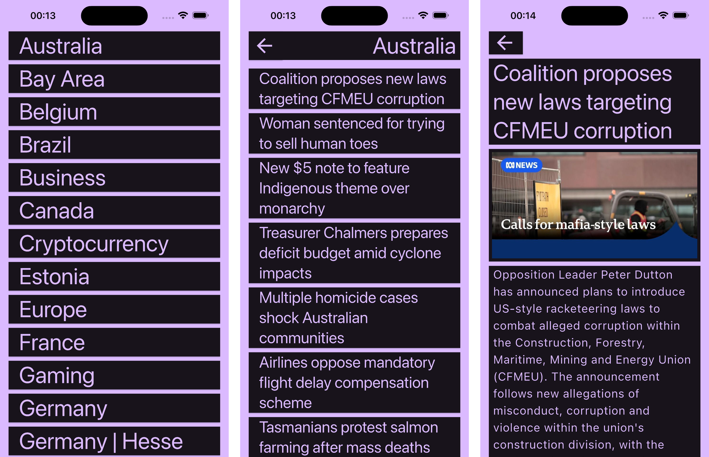
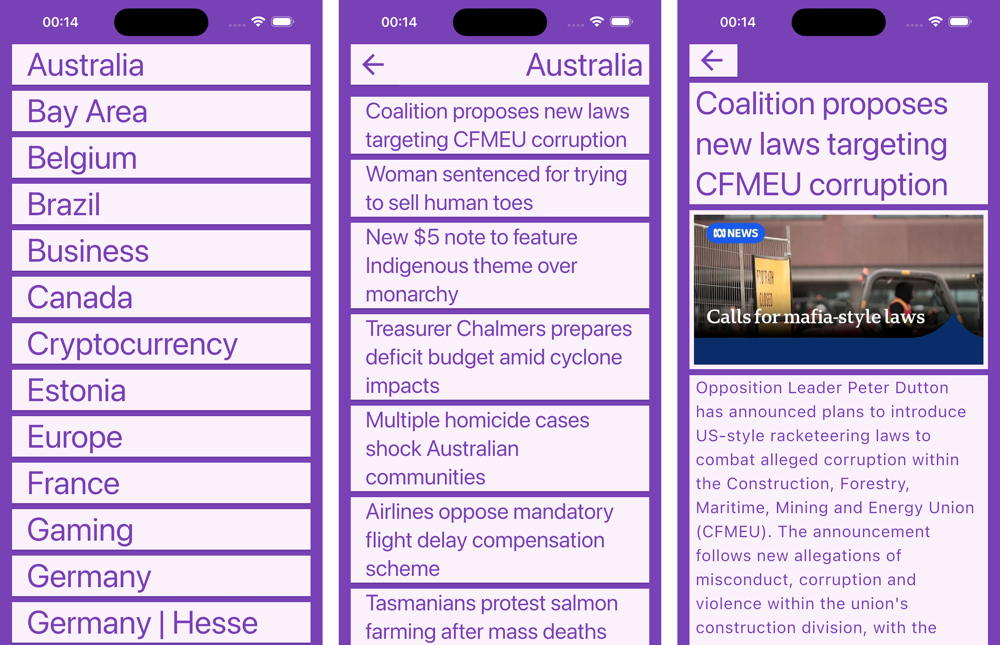
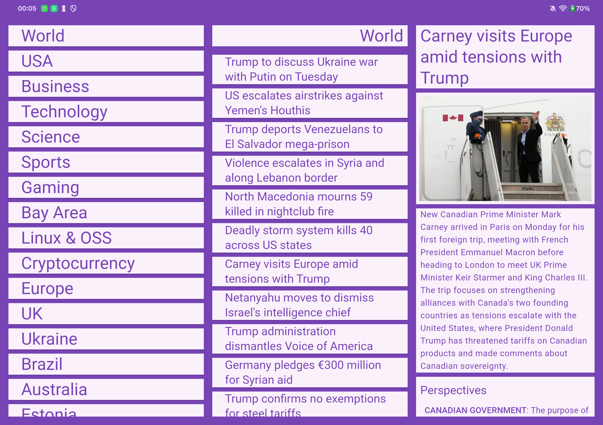
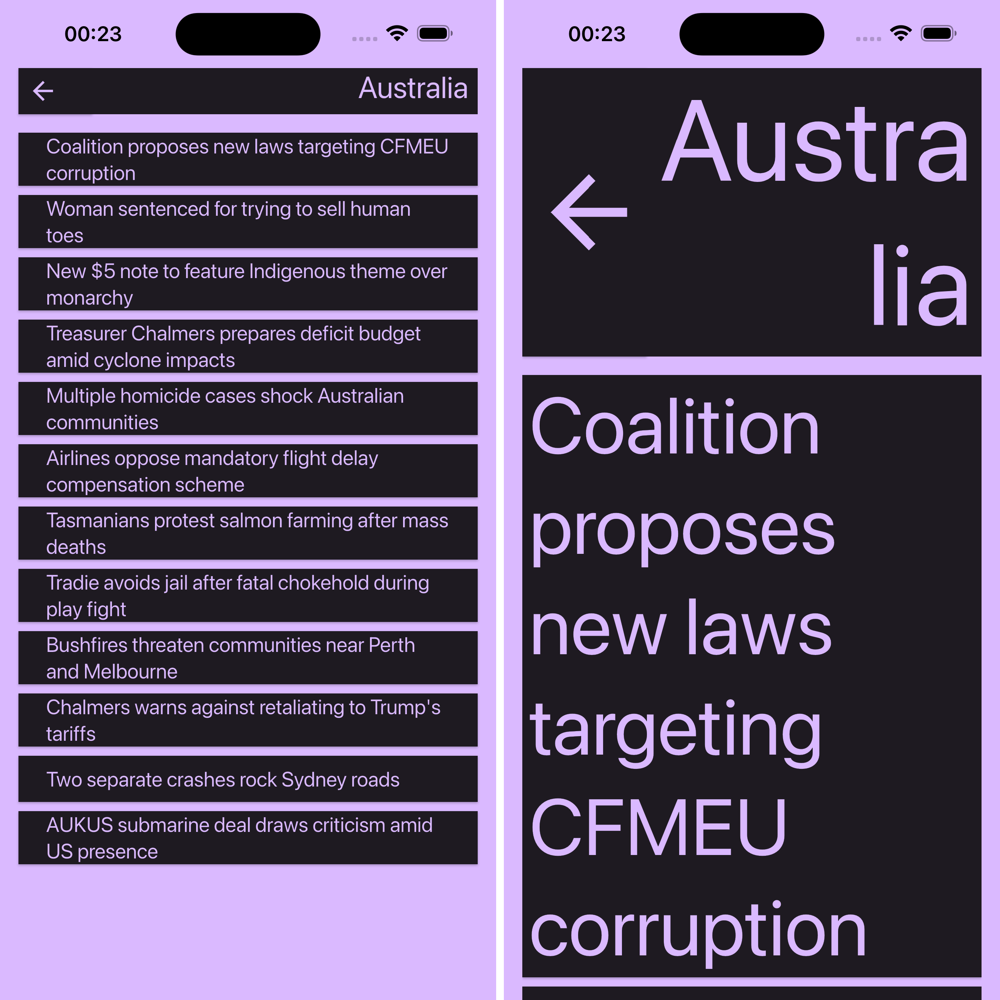

# Gallery

## Light vs Dark

## Narrow vs Wide

The first image showcases the 3 screens of the narrow layout. The second image showcases the single screen of the wide layout. Note how the back buttons are removed, as all content is displayed in a single screen.

## Small vs Big font size

Note how the Back icon grows in size with the font, as the assumption is that if a user needs a bigger font, they'll probably need a bigger icon too.

## Screen Readers

Remember to turn audio up!

https://github.com/juandelgado/kagi-test/raw/refs/heads/main/images/accessibility.mp4
